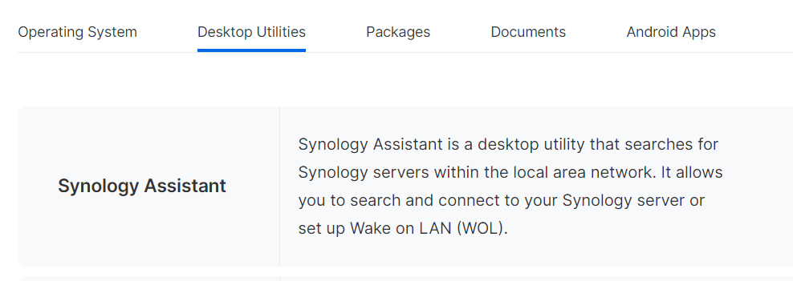

::post-title{:date="date"}
# Can't Find Synology NAS in my Network
::

::notes
This is a repost from my old blog. First posted in 6/21/2024.
::

 

One day, mapped drives to my NAS stopped working and the NAS itself just disappeared from my network.

 

My first thought was either the NAS broke or my router. But my router seems fine, so I first checked my NAS by directly connecting to it via ethernet cable to my laptop (using USB converter). I also downloaded the Synology Assistant software which helps a lot in finding whether there's Synology NAS in the network.

 

The Synology Assistant can be found in Synology Download Center under Desktop Utilities. Synology NAS model required to find the right software.

[https://www.synology.com/en-us/support/download]{.text-blue-600}

 

My NAS was working well, so I decided to reboot my router. After the router reboots, I detached the NAS from the laptop and connect it back to the router. And my NAS is discoverable in the network again. However, it happened again when I transferred a large amount of files. Probably it overwhelms the router as I use an old Netgear Wifi 5 router.

 

There's also a possibility that firewall on the laptop interferes in discovering the NAS, but in my case, since I was able to find it before the issue and no configuration changed since then, it is not a point of concern. But just in case, I did check the firewall configuration as well and it was configured correctly.

